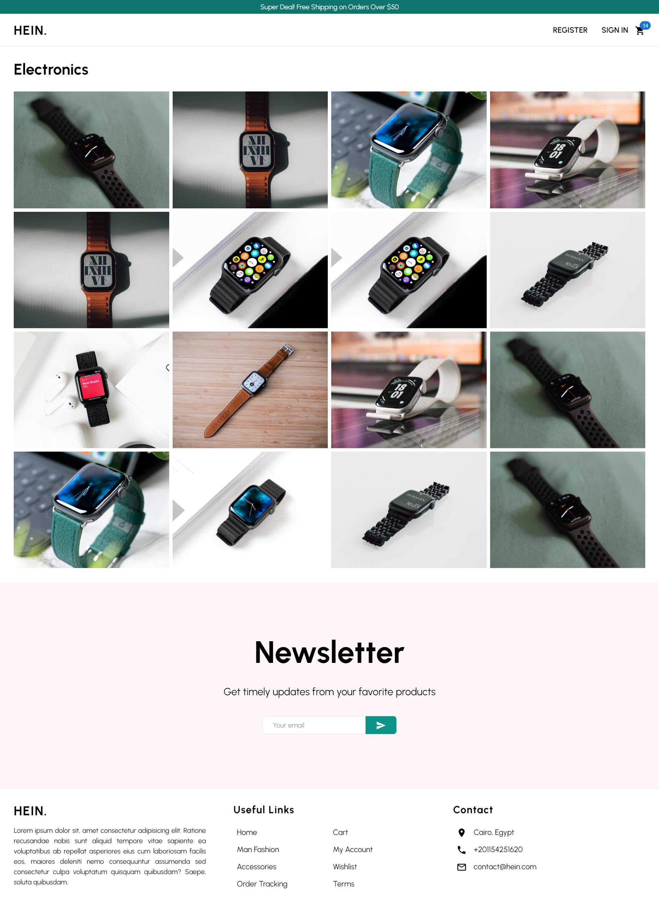
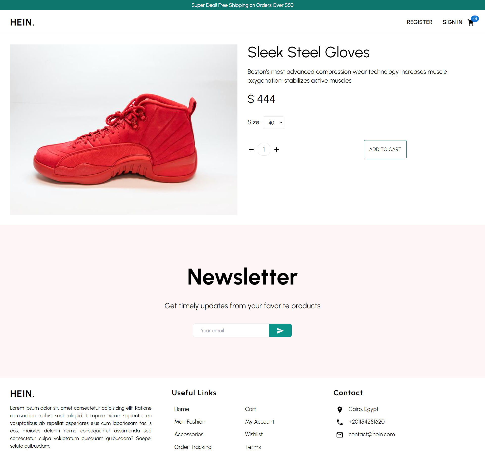
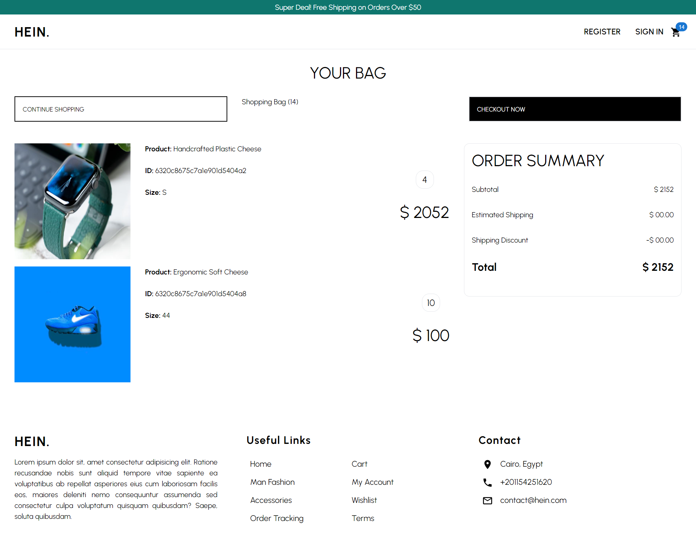
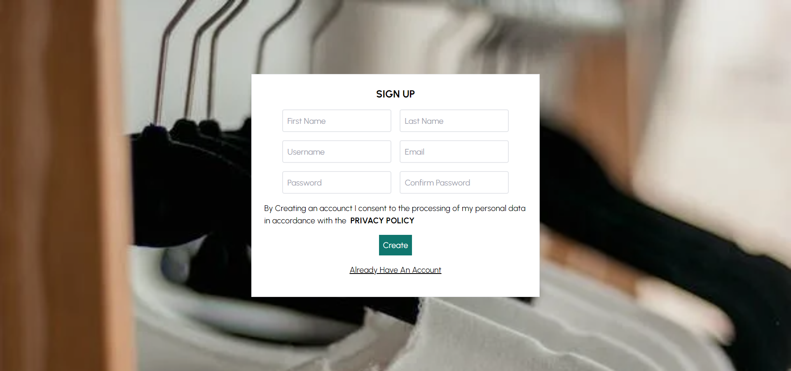
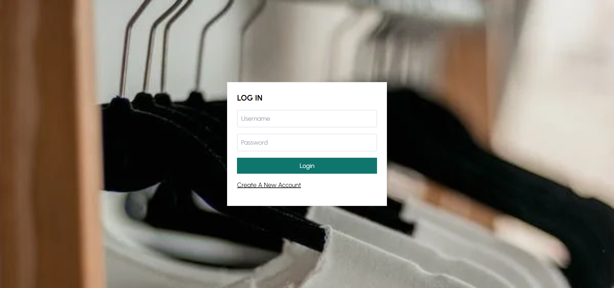

# HEIN.

Ecommerce Web Application built with the MERN Stack.
Inspired by [_Lama Dev_](https://www.youtube.com/c/LamaDev)

## 🏁 Get Started

1. **_Clone the repository_**

```sh
git clone https://github.com/YousefElshabrawy/HEIN..git
```

2. **_Navigate to the repository directory_**

```sh
$ cd HEIN.
```

### 💻 Client

1. **_Navigate to the client directory_**

```sh
$ cd client
```

2. **_Install dependencies_**

```sh
$ npm install
```

#### Running

1. **_Compile and hot-reload for development_**

```sh
$ npm run dev
```

2. **_Compile for production_**

```sh
$ npm run build
```

### 💻 Server

1. **_Navigate to the server directory_**

```sh
$ cd server
```

2. **_Install dependencies_**

```sh
$ npm install
```

#### Running

1. **_Compile and hot-reload for development_**

```sh
$ npm run start
```

2. **_Compile for production_**

```sh
$ npm run build
```

## 💻 Built With

- **ReactJS**
- **Redux**
- **NodeJS**
- **ExpressJS**
- **MongoDB**
- **TailwindCSS**
- **Stripe**

## 📂 File Structure

```sh
|-- README.md
|-- client
|   |-- index.html
|   |-- package-lock.json
|   |-- package.json
|   |-- postcss.config.cjs
|   |-- public
|   |-- src
|   |   |-- App.jsx
|   |   |-- assets
|   |   |-- components
|   |   |   |-- Carousel.jsx
|   |   |   |-- CartProduct.jsx
|   |   |   |-- Categorie.jsx
|   |   |   |-- Categories.jsx
|   |   |   |-- Filter.jsx
|   |   |   |-- Newsletter.jsx
|   |   |   |-- Product.jsx
|   |   |   |-- Products.jsx
|   |   |   `-- Title.jsx
|   |   |-- index.css
|   |   |-- layout
|   |   |   |-- Announcement.jsx
|   |   |   |-- Footer.jsx
|   |   |   `-- Navbar.jsx
|   |   |-- main.jsx
|   |   |-- pages
|   |   |   |-- Home.jsx
|   |   |   |-- Login.jsx
|   |   |   |-- Orders.jsx
|   |   |   |-- ShoppingCart.jsx
|   |   |   |-- ShoppingCategorie.jsx
|   |   |   |-- Signup.jsx
|   |   |   `-- SingleProduct.jsx
|   |   |-- request-methods.js
|   |   `-- store
|   |       |-- auth-actions.js
|   |       |-- auth-slice.js
|   |       |-- cart-slice.js
|   |       `-- index.js
|   |-- tailwind.config.cjs
|   `-- vite.config.js
`-- server
    |-- controllers
    |   |-- auth.js
    |   |-- cart.js
    |   |-- order.js
    |   |-- product.js
    |   `-- user.js
    |-- db
    |   |-- cleanup-script.js
    |   |-- fake-api-products.json
    |   `-- products.json
    |-- index.js
    |-- middlewares
    |   `-- verifyToken.js
    |-- models
    |   |-- Cart.js
    |   |-- Order.js
    |   |-- Product.js
    |   `-- User.js
    |-- package-lock.json
    |-- package.json
    `-- routes
        |-- auth.js
        |-- cart.js
        |-- order.js
        |-- product.js
        |-- stripe.js
        `-- user.js
```

## 📷 Screenshots

- ### Large Screens
  
  <br>
  
  <br>
  
  <br>
  
  <br>
  
  <br>
  

## 🎥 Demo Videos

https://user-images.githubusercontent.com/62210671/191046065-db8459d3-83ea-41a0-a898-abfd42432277.mp4
